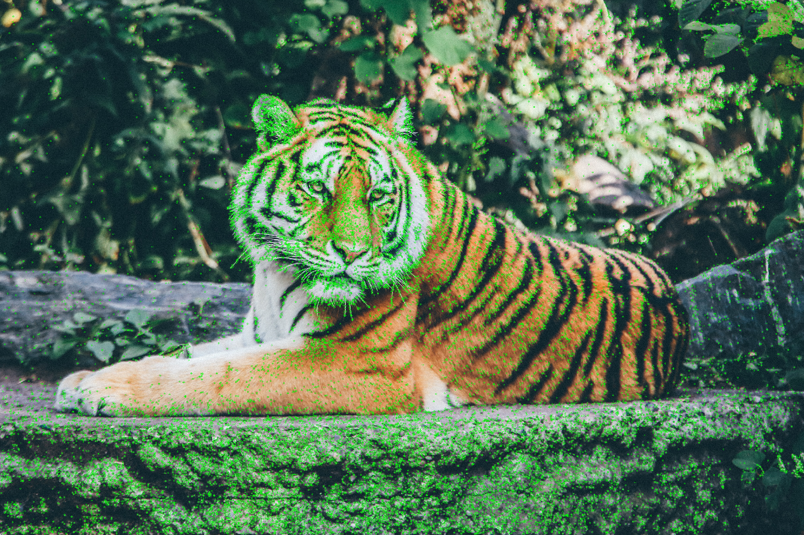

# risearch

writing reverse image search to learn go

# deps

* [gocv](https://gocv.io/)

## Basic idea:
* Construct a matrix of SIFT descriptors of each reference image
* Compute SIFT descriptors of an input image
* Compare similarity across all reference images (kmeans?)
